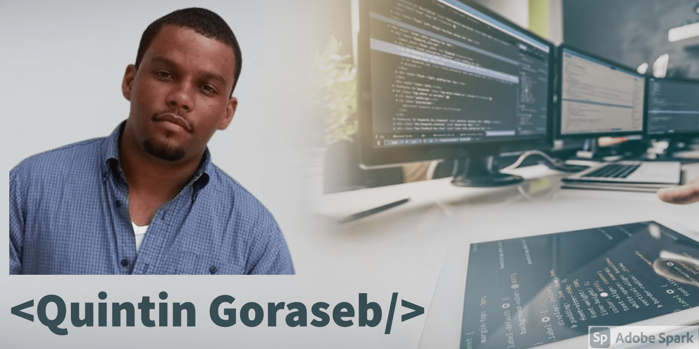

<!---
QuintinGoraseb/QuintinGoraseb is a ✨ special ✨ repository because its `README.md` (this file) appears on your GitHub profile.
You can click the Preview link to take a look at your changes.
--->

### Hi there, I'm Quintin J. Goraseb - aka [SOFTLogiQ][website] :computer:

<!---->

## :mortar_board: I'm a Software Engineer

- 👀 I’m interested in all branches of Software Development
- 🌱 I’m currently learning everything Python 🤣
- 👯 I’m looking to collaborate with other content creators
- 🥅 2021 Goals: Contribute more to Open Source projects
- ⚡ Fun fact: I love to create websites when i am bored

### Connect with me:

[][website]
[][youtube]
[][linkedin]

 

### Languages and Tools:

 
 
 
 

<!--https://github.com/anuraghazra/github-readme-stats-->

---
### :trophy::star: Skills & Interest
<!-- Skill Set -->
- Access Management
- Database Design & Maintenance
- Systems Installation, Configuration & Upgrading
- Networking (LAN, WAN)
- Troubleshooting
- Automation
- Scrum & Agile Methodologies
- Software Development Life cycle
- Requirements Engineering
- Project Management
- Web & Mobile Application Design &
Development
<!-- End Skill Set -->

<!--### 📺 Latest YouTube Videos

YOUTUBE:START 
- [How To Manage Multiple APIs with RapidAPI (2021)](https://www.youtube.com/watch?v=NFToND6x_nI)
- [How Core Web Vitals Will Affect Google Rankings in 2021 | Interview :: Lee Robinson](https://www.youtube.com/watch?v=-lcDZDfjekc)
- [Build Fullstack Apps in Record Time with Blitz.js | Interview :: Brandon Bayer (2021)](https://www.youtube.com/watch?v=S9qqImLjJFY)
- [Create an Application Backend in Clicks with the Amplify Admin UI | Interview :: Ali Spittel (2021)](https://www.youtube.com/watch?v=SvPJMwbR8ac)
- [The Third Age of JavaScript | Interview :: Swyx (2021)](https://www.youtube.com/watch?v=Nan1hqQ90_4)
YOUTUBE:END -

➡️ [more videos...](https://youtube.com/codestackr)-->

---

### 📕 Latest Blog Posts

<!-- BLOG-POST-LIST:START -->
- [How To Pass Application Tracking Systems (ATS) & Get Interviews - Resume Tips for Software Developer](https://dev.to/codestackr/how-to-pass-application-tracking-systems-ats-get-interviews-resume-tips-for-software-developer-4bmo)
- [Microinteractions: Password Validation Animation](https://dev.to/codestackr/microinteractions-password-validation-animation-5629)
- [Notion + YouTube - A Powerful Combination for Productivity](https://dev.to/codestackr/notion-youtube-a-powerful-combination-for-productivity-1def)
- [Regular Expressions (RegEx) Crash Course](https://dev.to/codestackr/regular-expressions-regex-crash-course-248n)
- [Emmet Part 2 - Advanced](https://dev.to/codestackr/emmet-part-2-advanced-4c65)
<!-- BLOG-POST-LIST:END -->

➡️ [more blog posts...](https://codestackr.com)

---

  
:zap: Recent GitHub Activity

  
<!--START_SECTION:activity
1. 🗣 Commented on [#1](https://github.com/codeSTACKr/portfolio-sass/issues/1) in [codeSTACKr/portfolio-sass](https://github.com/codeSTACKr/portfolio-sass)
2. 🎉 Merged PR [#1](https://github.com/codeSTACKr/portfolio-sass/pull/1) in [codeSTACKr/portfolio-sass](https://github.com/codeSTACKr/portfolio-sass)
3. 🗣 Commented on [#10](https://github.com/codeSTACKr/codestackr-vscode-theme/issues/10) in [codeSTACKr/codestackr-vscode-theme](https://github.com/codeSTACKr/codestackr-vscode-theme)
4. 🗣 Commented on [#11](https://github.com/codeSTACKr/codestackr-vscode-theme/issues/11) in [codeSTACKr/codestackr-vscode-theme](https://github.com/codeSTACKr/codestackr-vscode-theme)
5. ❌ Closed PR [#1](https://github.com/codeSTACKr/spotify-now-playing/pull/1) in [codeSTACKr/spotify-now-playing](https://github.com/codeSTACKr/spotify-now-playing)
END_SECTION:activity-->

  
:zap: GitHub Stats

<!---->

  

[website]: https://softlogiq.com.na
[course]: http://vsCodeHero.com
[youtube]: https://www.youtube.com/channel/UCHTbPSkG1hExKw7DrFBiARg
[linkedin]: https://www.linkedin.com/in/quintin-goraseb-85a420213/
